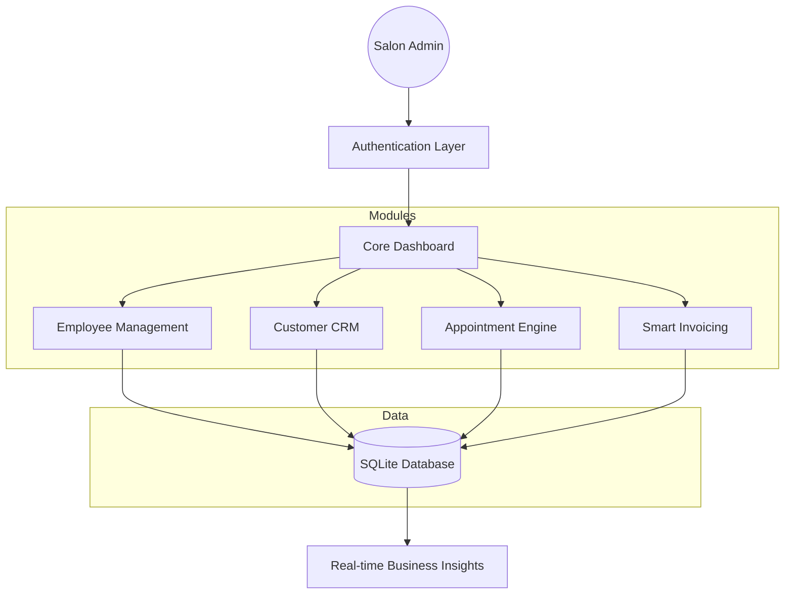

# 💇 Salon Management ERP System (V2 Advance)

<div align="center">
  
  
  
  
</div>

---


## 🏢 Overview
**Salon Management ERP V2 Advance** is a premium, all-in-one business management solution tailored for high-end salons, spas, and beauty centers. Developed using **Streamlit**, this enterprise-grade application offers a seamless, real-time interface to manage every aspect of salon operations—from staff attendance to complex billing and customer retention analytics.

This version is engineered for scalability, featuring a robust SQLite backend, dynamic data visualization, and an intuitive user experience designed to minimize operational friction.

## 🌟 Core Pillars

> [!TIP]
> **Operational Excellence**: Automate daily tasks so you can focus on providing world-class beauty services.

| Feature | Description | Benefit |
| :--- | :--- | :--- |
| **Smart Dashboard** | Real-time KPI tracking & Revenue analytics. | Data-driven decision making. |
| **Unified Billing** | Instant invoice generation & service tracking. | Faster checkouts & accurate accounting. |
| **Client CRM** | Comprehensive customer history & preferences. | Enhanced loyalty & personalized service. |
| **Staff HQ** | Attendance, performance & role management. | Optimized workforce productivity. |

---

## 🛠️ System Architecture



---

## 🚀 Key Modules

### 📊 Intelligence Dashboard
*   **Revenue Metrics**: Tracks total earnings (₹) with real-time updates.
*   **Service Analytics**: Bar charts visualizing the most popular services.
*   **Growth Insights**: Automated metrics for customer and appointment volume.

### 📅 Advanced Appointment Engine
*   Seamless booking flow to eliminate schedule overlaps.
*   Status tracking for pending, completed, or cancelled appointments.

### 🧾 Smart Billing & Financials
*   Automated price calculation based on service type.
*   Instant digital invoice generation.
*   Historical billing records for audit and tax purposes.

### 👩‍💼 Human Resource Management
*   Full staff profiling and contact management.
*   Integrated attendance tracking system (Check-in/Check-out).

---

## 💻 Tech Stack
- **Frontend/UX**: [Streamlit](https://streamlit.io/) (High-performance web framework)
- **Database**: SQLite3 (ACID compliant, zero-config relational DB)
- **Data Analysis**: Pandas (Advanced data manipulation)
- **Visuals**: Matplotlib / Streamlit Charts
- **UI/UX**: Custom CSS Injection & Google Fonts

---

## 📦 Installation & Deployment

### Prerequisites
- Python 3.9 or higher
- Pip (Python Package Manager)

### Step-by-Step Setup

1.  **Clone the Repository**
    ```bash
    git clone https://github.com/your-username/Salon-Management-V2.git
    cd Salon-Management-V2
    ```

2.  **Install Dependencies**
    ```bash
    pip install streamlit pandas
    ```

3.  **Run the Application**
    ```bash
    streamlit run app.py
    ```

> [!IMPORTANT]
> The system will automatically initialize `salon.db` on the first run. No manual database setup is required.

### Default Credentials
| Role | Username | Password |
| :--- | :--- | :--- |
| **Super Admin** | `admin` | `admin123` |

---

## 📂 Project Structure

```text
├── assets/               # Visual assets & banners
├── app.py                # Main entry point & routing
├── appointment.py        # Appointment scheduling logic
├── attendance.py         # Employee attendance tracking
├── auth.py               # Session & Authentication handling
├── billing.py            # Billing & Revenue management
├── customer.py           # Customer CRM module
├── database.py           # SQLite schema & connections
├── employee.py           # HR & Staff management
├── invoice.py            # PDF/Text Invoice generation logic
├── salon.db              # Local SQLite Database
├── search.py             # Global cross-module search
├── style.py              # Custom CSS & UI components
└── utils.py              # Helper functions
```

---

## 🔍 Feature Deep-Dive

### 🛡️ Secure Authentication
The system uses a state-persistent login mechanism. Sessions are managed via Streamlit's `session_state`, ensuring that sensitive business data is only accessible to authorized personnel.

### 🔎 Global Search Engine
Located in the sidebar, the Global Search allows admins to find records across the entire database instantly. Whether it's a customer's phone number or an employee's ID, the system fetches results in milliseconds.

### 📄 Dynamic Invoicing
When a bill is generated, the system creates a formatted view (and logic for export) that includes service details, taxes, and total amounts, ready for the customer.

### 📉 Persistence Layer
Unlike basic Streamlit apps, this ERP uses a relational database (`sqlite3`). All data—from employee salaries to historical billing—is persisted locally, allowing the business to track growth over years.

---

## 🤝 Contribution & Support
Contributions are what make the open-source community such an amazing place to learn, inspire, and create. Any contributions you make are **greatly appreciated**.

1. Fork the Project
2. Create your Feature Branch (`git checkout -b feature/AmazingFeature`)
3. Commit your Changes (`git commit -m 'Add some AmazingFeature'`)
4. Push to the Branch (`git push origin feature/AmazingFeature`)
5. Open a Pull Request

## 📄 License
Distributed under the **MIT License**. See `LICENSE` for more information.

---
<div align="center">
  <b>Built with ❤️ for the Beauty Industry</b><br>
  <i>Simplifying salon management, one click at a time.</i>
</div>

