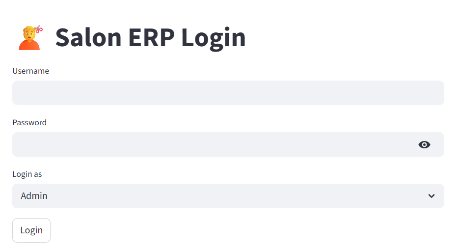
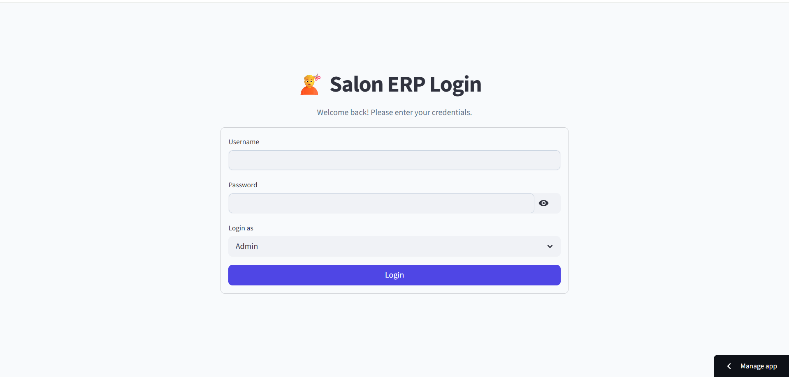
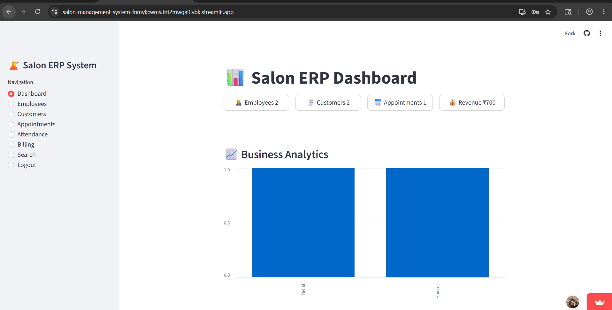
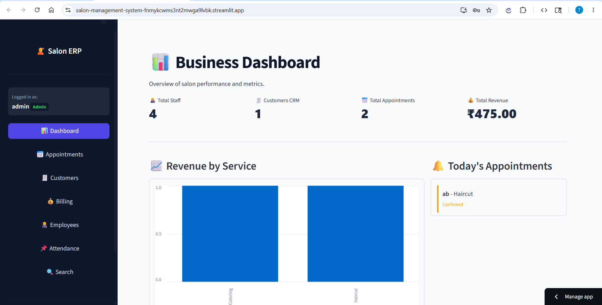
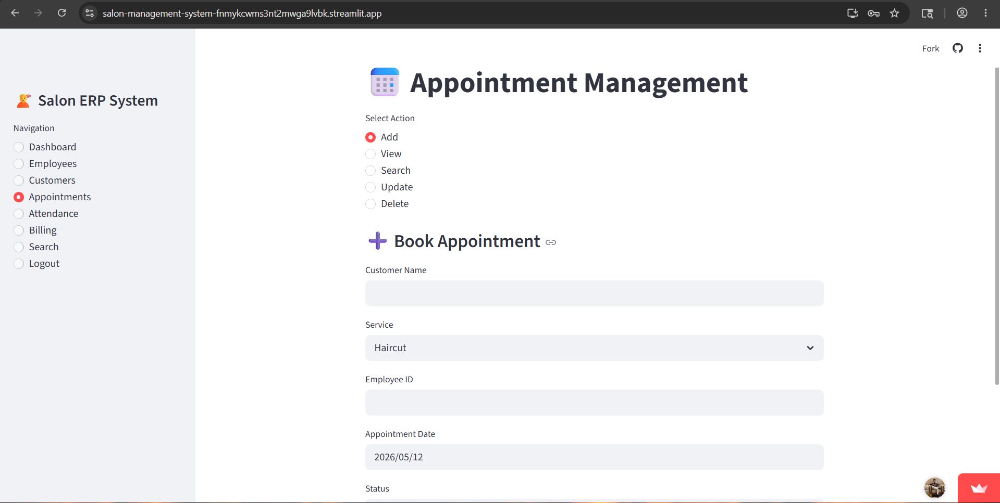
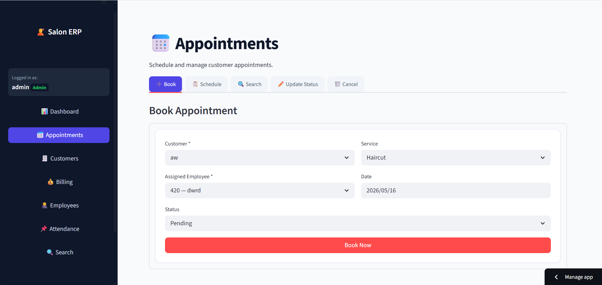
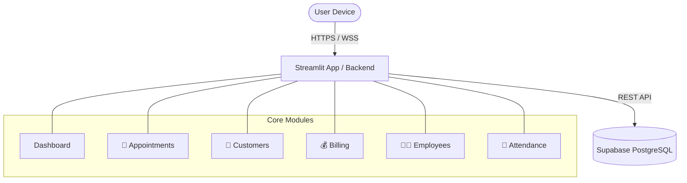
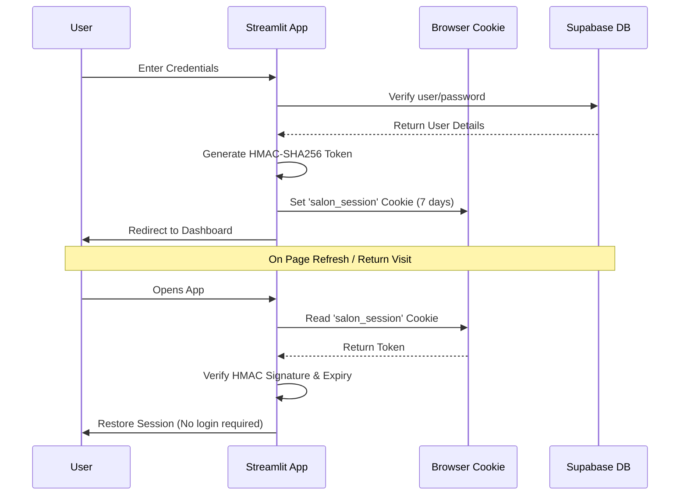

# 💇 Salon ERP — V3 → V4 Upgrade Notes

> This document explains every bug that was found and fixed, every improvement
> made, and shows the exact **before vs after** code so you can see precisely
> what changed and why.

---

##  Live Demo       
## ⚠️ Note currently this option is not working due to limitation of using free server
**Link:** [https://salon-management-system.streamlit.app/](https://salon-management-system.streamlit.app/)  
**Username:** `admin`  
**Password:** `admin123`  

---

##  UI Gallery (Before & After)

### Login Page
| Old UI (V3) | New UI (V4) |
|-------------|-------------|
|  |  |

### Dashboard
| Old UI (V3) | New UI (V4) |
|-------------|-------------|
|  |  |

### Appointments
| Old UI (V3) | New UI (V4) |
|-------------|-------------|
|  |  |

### Employee Management
| Old UI (V3) | New UI (V4) |
|-------------|-------------|
|  |  |

---

##  Table of Contents

1. [🏗️ System Architecture](#architecture)
2. [Quick Summary](#summary)
3. [🐛 Bug Fix 1 — Logged Out on Every Refresh](#bug1)
4. [🐛 Bug Fix 2 — Mobile Navigation Completely Broken](#bug2)
5. [🐛 Bug Fix 3 — Sidebar Invisible / Not Showing](#bug3)
6. [🐛 Bug Fix 4 — Page Resets to Dashboard on Refresh](#bug4)
7. [🐛 Bug Fix 5 — Duplicate Customers Inserted Silently](#bug5)
8. [✨ Improvement 1 — Login Page Redesigned](#imp1)
9. [✨ Improvement 2 — Sidebar Gets a User Badge](#imp2)
10. [✨ Improvement 3 — Dashboard Quick Action Buttons](#imp3)
11. [✨ Improvement 4 — Tables Scroll on Mobile](#imp4)
12. [✨ Improvement 5 — Animations & Hover Effects](#imp5)
13. [✨ Improvement 6 — Touch-Friendly Buttons](#imp6)
14. [📁 File-by-File Summary](#files)
15. [⚙️ Setup & Installation](#setup)
16. [🔒 Security Notes](#security)
17. [📱 Mobile Tips](#mobile)

---

<a name="architecture"></a>
##  System Architecture

### Architecture Overview
The application follows a modern 2-tier architecture, combining a Python-based Streamlit frontend with a scalable PostgreSQL backend hosted on Supabase.



### Authentication Flow (HMAC Cookie Session)
To solve Streamlit's native session limitation, we built a secure token-based authentication flow that persists sessions across browser reloads.



### Database Interaction
All database interactions are routed through a centralized `database.py` module. This provides a clean interface for the application, abstracting away Supabase REST API calls. 
- **Caching**: Heavy reads (like employee lists or service menus) are cached using `@st.cache_data` to reduce database load and improve response times.
- **Write Operations**: Insert/Update actions automatically clear the relevant cache buffers using `clear_db_cache()` to ensure the UI instantly reflects new data.

### Module Structure
The system is heavily modularized for maintainability. Each business function lives in its own file and relies on shared utilities.

- `app.py` — Core router, state manager, and UI shell (sidebar & mobile nav)
- `auth.py` — Custom HMAC cookie generation and verification
- `database.py` — Supabase connection and caching logic
- `style.py` — UI framework, CSS overrides, mobile responsive breakpoints
- **Business Modules:** `appointment.py`, `attendance.py`, `billing.py`, `customer.py`, `employee.py`

---

<a name="summary"></a>
## 📋 Quick Summary

| # | Type | Problem | Fix |
|---|------|---------|-----|
| 1 | 🐛 Bug | User logged out on every browser refresh | HMAC cookie-based persistent session |
| 2 | 🐛 Bug | Mobile users couldn't reach any section except Dashboard | Fixed bottom navigation bar for mobile |
| 3 | 🐛 Bug | Sidebar buttons invisible / sidebar not showing | Fixed CSS selectors for Streamlit v1.32+ |
| 4 | 🐛 Bug | Page always reset to Dashboard on refresh | Page saved in URL query params |
| 5 | 🐛 Bug | Duplicate customer phone numbers inserted silently | Duplicate check before insert |
| 6 | ✨ UI | Login form was plain and unstyled | Redesigned with branding, card, placeholders |
| 7 | ✨ UI | Sidebar had no user info or session details | User badge with role pill added |
| 8 | ✨ UI | Dashboard had no way to navigate on mobile | Quick Action buttons on Dashboard |
| 9 | ✨ UI | Tables clipped / overflowed on small screens | Horizontal scroll wrapper on all tables |
| 10 | ✨ UI | No page transitions — jarring navigation | Smooth fade-in animation on page load |
| 11 | ✨ UI | Buttons too small for touch screens | Min 44–48 px height on all tap targets |
| 12 | ✨ New | `extra-streamlit-components` for cookies | Added to `requirements.txt` |
| 13 | ✨ New | `SESSION_SECRET` for signing tokens | Added to `secrets.toml` |

---

<a name="bug1"></a>
## 🐛 Bug Fix 1 — Logged Out on Every Refresh

### What Was Happening
Every time the user pressed F5 or refreshed the browser, they were taken back to the
login screen and had to type their credentials again from scratch.

### Why It Happened
Streamlit stores data in `st.session_state`, which lives in memory only.
When the browser refreshes, Python restarts from zero — session state is wiped
and `logged_in` becomes `False` again.

### V3 Code (Broken)
```python
# auth.py — V3
def init_session():
    if "logged_in" not in st.session_state:
        st.session_state.logged_in = False   # always False on refresh
    if "role" not in st.session_state:
        st.session_state.role = None
    if "username" not in st.session_state:
        st.session_state.username = None
    # ❌ Never reads from cookie. Refresh = logged out. Always.
```

### V4 Code (Fixed)
```python
# auth.py — V4
def init_session():
    defaults = {
        "logged_in": False, "role": None, "username": None,
        "page": "Dashboard", "subpage": None, "_cookie_checked": False,
    }
    for k, v in defaults.items():
        if k not in st.session_state:
            st.session_state[k] = v

    # Already authenticated this run — skip
    if st.session_state.logged_in and st.session_state._cookie_checked:
        _sync_page_from_url()
        return

    # ✅ NEW: Read cookie and restore session automatically
    cookie_manager = _get_cookie_manager()
    token = cookie_manager.get(COOKIE_NAME)
    st.session_state._cookie_checked = True

    if token:
        user_data = _verify_token(str(token))   # checks signature + expiry
        if user_data:
            st.session_state.logged_in = True
            st.session_state.username  = user_data["username"]
            st.session_state.role      = user_data["role"]
            _sync_page_from_url()   # restore the page too
            return

    st.session_state.logged_in = False
```

```python
# auth.py — V4: On login, save a signed cookie
if users:
    token   = _make_token(actual_user, actual_role)    # ← NEW
    expires = datetime.now() + timedelta(days=7)       # ← NEW
    cookie_manager.set(COOKIE_NAME, token, expires_at=expires)  # ← NEW
    st.query_params["page"] = "Dashboard"              # ← NEW
    st.session_state.logged_in = True
    ...
```

```python
# auth.py — V4: On logout, delete the cookie
def logout():
    for key in ["logged_in", "role", "username", "page", ...]:
        st.session_state.pop(key, None)
    cookie_manager.delete(COOKIE_NAME)   # ← NEW: delete cookie
    st.query_params.clear()              # ← NEW: clean URL
    st.rerun()
```

**How the token works:**
```
token = "username|role|unix_timestamp|HMAC-SHA256-signature"
```
The signature is created with a secret key from `secrets.toml`.
If anyone tampers with the token or it is older than 7 days, it is rejected.

### Result After Fix
| Scenario | V3 | V4 |
|----------|----|----|
| Browser refresh | ❌ Logged out | ✅ Stays logged in |
| Close tab and reopen | ❌ Logged out | ✅ Stays logged in (7 days) |
| Logout button | ✅ Works | ✅ Works + clears cookie |
| Tampered cookie | Not applicable | ✅ Rejected, redirected to login |

---

<a name="bug2"></a>
## 🐛 Bug Fix 2 — Mobile Navigation Completely Broken

### What Was Happening
On any mobile phone (Android or iPhone), users could only see the Dashboard.
There was no visible way to reach Employees, Customers, Billing, Appointments,
Attendance, or Search from a phone.

### Why It Happened
All navigation links were inside the sidebar. On mobile, Streamlit collapses
the sidebar by default behind a tiny hamburger icon (☰) that most users never
notice. There was zero fallback navigation.

### V3 Code (Broken)
```python
# app.py — V3
# ALL navigation was ONLY in the sidebar — invisible on mobile
with st.sidebar:
    if st.button("📊 Dashboard"):    navigate("Dashboard")
    if st.button("📅 Appointments"): navigate("Appointments")
    if st.button("🧾 Customers"):    navigate("Customers")
    if st.button("💰 Billing"):      navigate("Billing")
    if st.button("👩‍💼 Employees"):   navigate("Employees")
    if st.button("📌 Attendance"):   navigate("Attendance")
    if st.button("🔍 Search"):       navigate("Search")
    #  On mobile = sidebar collapsed = none of these visible
```

### V4 Code (Fixed)
We added a **bottom navigation bar** — always visible at the bottom of the
screen on phones, just like WhatsApp or Instagram. It is hidden on desktop
via a CSS media query so desktop users see no change.

```css
/* style.py — NEW: mobile bottom nav */
@media (max-width: 768px) {
    .mobile-nav {
        display: flex !important;     /* ← only shows on mobile */
        position: fixed;
        bottom: 0;
        left: 0; right: 0;
        z-index: 9999;
        background: #0f172a;
        height: 60px;
        justify-content: space-around;
        border-top: 1px solid #1e293b;
        box-shadow: 0 -4px 20px rgba(0,0,0,0.3);
    }
    .mobile-nav a {
        display: flex;
        flex-direction: column;
        align-items: center;
        justify-content: center;
        flex: 1;
        color: #94a3b8;
        text-decoration: none;
        font-size: 0.6rem;
        font-weight: 600;
        min-height: 44px;            /* ← Apple touch target minimum */
    }
    .mobile-nav a.active {
        color: #4f46e5;
        border-top: 2px solid #4f46e5;
        background: rgba(79,70,229,0.08);
    }
}

/* Hidden on desktop */
.mobile-nav { display: none; }
```

```python
# style.py — NEW: mobile_bottom_nav() function
def mobile_bottom_nav(current_page: str) -> None:
    pages = [
        ("Dashboard",    "📊", "Home"),
        ("Appointments", "📅", "Appts"),
        ("Customers",    "🧾", "CRM"),
        ("Billing",      "💰", "Bill"),
        ("Employees",    "👩‍💼", "Staff"),
        ("Attendance",   "📌", "Attend"),
        ("Search",       "🔍", "Search"),
    ]
    items_html = ""
    for page_key, icon, label in pages:
        active_cls = "active" if current_page == page_key else ""
        href = f"?page={page_key}"     # tapping updates URL → Streamlit reads it
        items_html += (
            f'<a href="{href}" class="{active_cls}">'
            f'<span>{icon}</span><span>{label}</span></a>'
        )
    st.markdown(f'<nav class="mobile-nav">{items_html}</nav>',
                unsafe_allow_html=True)
```

```python
# app.py — NEW: call mobile nav after sidebar
with st.sidebar:
    ...  # existing sidebar nav (desktop)

# ✅ Inject bottom nav — visible only on mobile via CSS
mobile_bottom_nav(st.session_state.page)
```

### Result After Fix
| Section | V3 Mobile | V4 Mobile |
|---------|-----------|-----------|
| Dashboard | ✅ Visible | ✅ Visible |
| Appointments | ❌ Hidden | ✅ Bottom tab |
| Customers | ❌ Hidden | ✅ Bottom tab |
| Billing | ❌ Hidden | ✅ Bottom tab |
| Employees | ❌ Hidden | ✅ Bottom tab |
| Attendance | ❌ Hidden | ✅ Bottom tab |
| Search | ❌ Hidden | ✅ Bottom tab |

---

<a name="bug3"></a>
## 🐛 Bug Fix 3 — Sidebar Invisible / Not Showing

### What Was Happening
After upgrading to Streamlit 1.32+, the sidebar buttons appeared as blank white
boxes with no text, or the sidebar background was not applying the dark colour.
The CSS selectors from V3 stopped working.

### Why It Happened
Streamlit changed its internal HTML structure in v1.32. The old CSS targeted
`section[data-testid="stSidebar"] button` which stopped matching the new
button wrapper structure. The `button[kind="primary"]` attribute selector also
stopped working reliably.

### V3 CSS (Broken)
```css
/* style.py — V3 */
section[data-testid="stSidebar"] {
    background-color: var(--sidebar-bg);   /* ← sometimes ignored */
}
section[data-testid="stSidebar"] button {
    border-radius: 8px !important;         /* ← stopped matching in v1.32 */
}
section[data-testid="stSidebar"] button[kind="primary"] {
    background-color: var(--primary) !important;  /* ← not always applied */
}
```

### V4 CSS (Fixed)
```css
/* style.py — V4: target all possible Streamlit internal wrappers */
section[data-testid="stSidebar"],
section[data-testid="stSidebar"] > div,
section[data-testid="stSidebar"] > div:first-child {
    background-color: var(--sidebar-bg) !important;
    border-right: 1px solid #1e293b !important;
}

/* Target the actual rendered button element AND its wrapper */
section[data-testid="stSidebar"] .stButton > button {
    width: 100% !important;
    border-radius: 10px !important;
    min-height: 44px !important;
    background-color: rgba(255,255,255,0.05) !important;
    color: #cbd5e1 !important;
    text-align: left !important;
    justify-content: flex-start !important;
    font-weight: 600 !important;
}

/* Active page button — uses both kind AND data-testid for compatibility */
section[data-testid="stSidebar"] .stButton > button[kind="primary"],
section[data-testid="stSidebar"] .stButton > button[data-testid="baseButton-primary"] {
    background-color: var(--primary) !important;
    color: white !important;
    box-shadow: 0 4px 10px rgba(79,70,229,0.4) !important;
}

/* Sidebar collapse arrow — visible on dark background */
button[data-testid="collapsedControl"] {
    background-color: var(--primary) !important;
    color: white !important;
    border-radius: 0 8px 8px 0 !important;
}
```

### Result After Fix
- ✅ Sidebar background is dark on all Streamlit versions
- ✅ All navigation buttons are visible with white text
- ✅ Active page button is highlighted in indigo
- ✅ Sidebar collapse arrow is visible against dark background

---

<a name="bug4"></a>
## 🐛 Bug Fix 4 — Page Resets to Dashboard on Refresh

### What Was Happening
If a user was on the Billing page and pressed refresh, they would land on
Dashboard and had to navigate back manually every time.

### Why It Happened
The current page was only stored in `st.session_state.page`. Since session
state is wiped on refresh, the page defaulted to "Dashboard" every time.

### V3 Code (Broken)
```python
# utils.py — V3
def navigate(page, subpage=None):
    st.session_state.page = page       # ← only in memory, lost on refresh
    st.session_state.subpage = subpage
    st.rerun()
```

### V4 Code (Fixed)
```python
# utils.py — V4
def navigate(page, subpage=None):
    st.session_state.page    = page
    st.session_state.subpage = subpage
    st.query_params["page"]  = page    # ← NEW: also write to URL
    st.rerun()
```

```python
# auth.py — V4: On cookie restore, also read page from URL
def _sync_page_from_url():
    url_page = st.query_params.get("page", None)
    if url_page and url_page in VALID_PAGES:
        st.session_state.page = url_page   # ← restores the correct page
```

The page is now in the URL as `?page=Billing`. The URL survives browser
refresh natively — no extra libraries needed.

### Result After Fix
- ✅ Refresh on Billing → lands on Billing
- ✅ Refresh on Employees → lands on Employees
- ✅ Browser Back button respects visited pages
- ✅ Bookmark a specific page URL and it opens directly

---

<a name="bug5"></a>
## 🐛 Bug Fix 5 — Duplicate Customers Inserted Silently

### What Was Happening
If a staff member added a customer with the same phone number twice,
the database accepted both records without any warning. This caused
duplicate entries and confusing search results.

### V3 Code (Broken)
```python
# customer.py — V3
if st.button("Add Customer"):
    ok = supabase_insert("customers", {
        "cust_name": name, "phone": phone, ...
    })
    # ❌ No duplicate check. Two customers, same phone = both inserted.
```

### V4 Code (Fixed)
```python
# customer.py — V4
if submit:
    if supabase_exists("customers", {"phone": phone_c}):   # ← NEW
        st.warning(f"⚠️ A customer with phone {phone_c} already exists.")
    else:
        ok = supabase_insert("customers", {
            "cust_name": name_c, "phone": phone_c, ...
        })
        if ok:
            clear_db_cache()   # ← NEW: refresh data immediately after insert
            st.success("Customer added!")
```

### Result After Fix
- ✅ Duplicate phone number → shows warning, blocks insert
- ✅ `clear_db_cache()` called after insert so the table refreshes immediately

---

<a name="imp1"></a>
## ✨ Improvement 1 — Login Page Redesigned

### Before (V3)
Plain text heading, no branding, input fields with no placeholders,
login button with no icon.

### After (V4)
```diff
- st.markdown("<h1 style='text-align: center;'>💇 Salon ERP Login</h1>")
- col1, col2, col3 = st.columns([1, 2, 1])
- with col2:
-     username = st.text_input("Username")
-     password = st.text_input("Password", type="password")
-     role = st.selectbox("Login as", ["Admin", "Staff"])
-     if st.button("Login", ...):

+ # Large emoji + title + tagline
+ st.markdown("""
+     <div style="text-align:center; padding:2rem 0;">
+         <div style="font-size:4rem;">💇</div>
+         <h1>Salon ERP</h1>
+         <p style="color:#64748b;">Sign in to continue</p>
+     </div>
+ """, unsafe_allow_html=True)
+ col1, col2, col3 = st.columns([1, 1.4, 1])   # ← narrower, centred card
+ with col2:
+     with st.container(border=True):            # ← visible card border
+         st.markdown("<h3>🔐 Login</h3>")
+         username = st.text_input("Username", placeholder="Enter username")
+         password = st.text_input("Password", type="password",
+                                   placeholder="Enter password")
+         role = st.selectbox("Login as", ["Admin", "Staff"])
+         if st.button("🚀 Sign In", use_container_width=True, type="primary"):
+ # Footer note
+ st.markdown("Secure login • Session valid for 7 days")
```

---

<a name="imp2"></a>
## ✨ Improvement 2 — Sidebar User Badge

### Before (V3)
```python
# app.py — V3 sidebar
st.markdown(f"<strong>{username}</strong> [{role}]")
# ← plain text, no visual distinction, no session info
```

### After (V4)
```python
# app.py — V4 sidebar
role_color = "#22c55e" if urole == "Admin" else "#3b82f6"
st.markdown(f"""
<div style="background:#1e293b; padding:10px 14px; border-radius:10px;
            margin-bottom:16px; border:1px solid #334155;">
    <span style="color:#94a3b8; font-size:11px;">Logged in as</span><br/>
    <div style="display:flex; justify-content:space-between; margin-top:4px;">
        <strong style="color:white; font-size:15px;">{uname}</strong>
        <span style="color:{role_color}; font-size:11px; font-weight:700;
                     background:#0f172a; padding:2px 8px; border-radius:999px;
                     border:1px solid {role_color}33;">
            {urole}
        </span>
    </div>
</div>
""", unsafe_allow_html=True)
st.markdown("🔒 Session valid for 7 days")
```

Result: A dark card showing the username and a colour-coded role badge
(green for Admin, blue for Staff), plus a session validity note.

---

<a name="imp3"></a>
## ✨ Improvement 3 — Dashboard Quick Action Buttons

### Before (V3)
Dashboard showed KPIs and a chart. No way to quickly jump to another
section from the Dashboard — especially a problem on mobile.

### After (V4)
```python
# app.py — V4 dashboard()
st.markdown("### ⚡ Quick Actions")
qa1, qa2, qa3, qa4 = st.columns(4)
with qa1:
    if st.button("📅 New Appointment", use_container_width=True):
        navigate("Appointments")
with qa2:
    if st.button("🧾 Add Customer", use_container_width=True):
        navigate("Customers")
with qa3:
    if st.button("💰 Create Invoice", use_container_width=True):
        navigate("Billing")
with qa4:
    if st.button("📌 Mark Attendance", use_container_width=True):
        navigate("Attendance")
```

---

<a name="imp4"></a>
## ✨ Improvement 4 — Tables Scroll on Mobile

### Before (V3)
```python
# employee.py — V3
st.dataframe(df, use_container_width=True, hide_index=True)
# ❌ On mobile: table wider than screen, content clipped, no scroll
```

### After (V4)
```python
# employee.py — V4
st.markdown('<div style="overflow-x:auto;">', unsafe_allow_html=True)
st.dataframe(df, use_container_width=True, hide_index=True)
st.markdown('</div>', unsafe_allow_html=True)
st.caption(f"Total: {len(df)} employee(s)")   # ← row count added
```

Also added globally in `style.py`:
```css
.stDataFrame > div {
    overflow-x: auto !important;
    -webkit-overflow-scrolling: touch;   /* momentum scroll on iOS */
}
```

---

<a name="imp5"></a>
## ✨ Improvement 5 — Animations & Hover Effects

### Before (V3)
```css
/* style.py — V3 */
div[data-testid="metric-container"]:hover {
    transform: translateY(-2px);   /* basic */
}
/* No page transition animation at all */
```

### After (V4)
```css
/* style.py — V4 */

/* Page fade-in on every navigation */
@keyframes fadeIn {
    from { opacity: 0; transform: translateY(6px); }
    to   { opacity: 1; transform: translateY(0); }
}
.main .block-container {
    animation: fadeIn 0.35s ease forwards;
}

/* Card hover — bigger lift + shadow */
div[data-testid="metric-container"] {
    transition: transform 0.2s ease, box-shadow 0.2s ease;
}
div[data-testid="metric-container"]:hover {
    transform: translateY(-3px);
    box-shadow: 0 10px 15px rgba(0,0,0,0.08);
}

/* Primary buttons — lift + glow on hover */
.stApp button[kind="primary"]:hover {
    transform: translateY(-1px) !important;
    box-shadow: 0 4px 12px rgba(79,70,229,0.4) !important;
}
```

---

<a name="imp6"></a>
## ✨ Improvement 6 — Touch-Friendly Buttons

### Before (V3)
No minimum height on buttons. On mobile they could be as small as 28 px —
too small to tap accurately on a phone.

### After (V4)
```css
/* style.py — V4 */
.stApp button {
    min-height: 44px !important;   /* Apple Human Interface Guidelines */
}

@media (max-width: 768px) {
    .stApp button {
        min-height: 48px !important;  /* slightly larger on mobile */
        font-size: 0.95rem !important;
    }
    .stTextInput input,
    .stNumberInput input,
    .stTextArea textarea {
        font-size: 16px !important;   /* prevents iOS Safari from zooming in */
        min-height: 48px !important;
    }
}
```
---
<a name="files"></a>
## 📁 File-by-File Summary

### `auth.py` — Fully Rewritten

| What | V3 | V4 |
|------|----|----|
| Session on refresh | Lost — always logged out | Restored from cookie silently |
| Login | Sets session_state only | Also generates token + writes cookie |
| Logout | Clears session_state only | Also deletes cookie + clears URL |
| Token security | None | HMAC-SHA256 signed, 7-day expiry |
| `_make_token()` | Did not exist | New — creates signed token |
| `_verify_token()` | Did not exist | New — validates signature + expiry |
| `_get_cookie_manager()` | Did not exist | New — singleton via @st.cache_resource |

### `style.py` — Fully Rewritten

| Section | V3 | V4 |
|---------|----|----|
| Sidebar CSS | Basic selectors (broke in v1.32) | Fixed with multiple selector fallbacks |
| Mobile nav | None | Fixed bottom nav bar, 7 tabs |
| Media queries | None | <768 px and 768–1024 px breakpoints |
| Page animation | None | fadeIn 0.35s on every load |
| Card hover | 2 px lift | 3 px lift + shadow |
| Button hover | Colour only | Lift + glow |
| Table overflow | Clipped | Horizontal scroll + iOS momentum |
| Input font (mobile) | 0.9rem | 16px (prevents iOS zoom) |
| Touch targets | Not enforced | 44–48 px min-height |
| Bottom nav padding | 2rem | 6rem (clears the bottom nav bar) |

### `app.py` — Updated

| Section | V3 | V4 |
|---------|----|----|
| Session init | `init_session()` | Same + now reads cookies |
| Page routing | session_state only | Also syncs `st.query_params["page"]` |
| Mobile nav | None | `mobile_bottom_nav()` injected |
| Dashboard KPIs | 4 cols | Same + CSS reflows to 2 on mobile |
| Dashboard quick actions | None | 4 quick-access buttons |
| Sidebar user info | Plain text | Styled badge with role pill |
| Unknown page | Would error | Graceful redirect to Dashboard |

### `utils.py` — Updated

```diff
  def navigate(page, subpage=None):
      st.session_state.page    = page
      st.session_state.subpage = subpage
+     st.query_params["page"]  = page    # ← NEW: also update URL
      st.rerun()
```

### `employee.py` — Updated
- `overflow-x:auto` div wrapper around every `st.dataframe` call
- `st.caption()` showing row count below each table
- Update tab uses a proper selectbox instead of a free-text ID field
- Delete tab shows the name in the confirmation warning

### `customer.py` — Updated
- Duplicate phone check before insert (`supabase_exists`)
- `clear_db_cache()` called after insert so directory refreshes instantly
- `overflow-x:auto` wrapper on all tables
- Phone validated as digits-only before hitting the database

### `requirements.txt` — Updated
```diff
  streamlit
  pandas
  reportlab
  Pillow
  supabase
+ extra-streamlit-components>=0.1.60
```

### `.streamlit/secrets.toml` — Updated
```diff
- DB_HOST     = "..."
- DB_NAME     = "postgres"
- DB_USER     = "..."
- DB_PASSWORD = "..."
- DB_PORT     = "6543"
- SUPABASE_KEY = "..."

+ SUPABASE_URL              = "https://your-project.supabase.co"
+ SUPABASE_SERVICE_ROLE_KEY = "your-service-role-key"
+ SESSION_SECRET            = "your-generated-secret"
```

> The `DB_*` keys were removed — the app uses the Supabase Python client,
> not a raw database connection, so those keys are not needed.
> `SUPABASE_KEY` was renamed to `SUPABASE_SERVICE_ROLE_KEY` which correctly
> bypasses Row Level Security on the server side.

### Files Not Changed (carried over from V3 unchanged)

| File | Why untouched |
|------|--------------|
| `database.py` | Well-structured, working correctly |
| `billing.py` | Download-button bug already fixed in V3 |
| `appointment.py` | Working correctly, no changes needed |
| `attendance.py` | Working correctly, no changes needed |
| `search.py` | Working correctly, no changes needed |
| `invoice.py` | PDF generation working correctly |
| `supabase_setup.sql` | Schema unchanged |

---

<a name="setup"></a>
##  Setup & Installation

### Step 1 — Install dependencies
```bash
pip install -r requirements.txt
```

### Step 2 — Configure secrets
Edit `.streamlit/secrets.toml` and fill in your values:
```toml
SUPABASE_URL              = "https://your-project.supabase.co"
SUPABASE_SERVICE_ROLE_KEY = "your-service-role-key"
SESSION_SECRET            = "paste-your-generated-secret-here"
```

To generate a strong `SESSION_SECRET`:
```bash
python -c "import secrets; print(secrets.token_hex(32))"
```

### Step 3 — Run the app
```bash
streamlit run app.py
```

### Step 4 — Deploying to Streamlit Cloud
1. Do **not** push `secrets.toml` to GitHub — add it to `.gitignore`
2. In Streamlit Cloud → App Settings → **Secrets** tab
3. Paste the three lines from Step 2 and click Save

---

<a name="security"></a>
## 🔒 Security Notes

| Practice | Where | Why |
|----------|-------|-----|
| HMAC-SHA256 token signing | `auth.py → _make_token()` | Prevents token forgery |
| `hmac.compare_digest()` | `auth.py → _verify_token()` | Prevents timing attacks |
| 7-day token expiry | `auth.py → SESSION_DURATION_DAYS` | Limits damage if token leaks |
| Service role key server-side only | `database.py` | Never sent to browser |
| All secrets in `secrets.toml` | Not hardcoded | Safe from accidental exposure |
| Cookie deleted on logout | `auth.py → logout()` | Prevents session reuse |
| URL cleared on logout | `st.query_params.clear()` | Prevents stale page on login |

---

<a name="mobile"></a>
##  Mobile Tips

1. **Test at 375 px** — iPhone SE width, the smallest common screen
2. **`font-size: 16px` on inputs** — smaller sizes trigger iOS Safari auto-zoom
3. **`min-height: 44px` on tap targets** — Apple Human Interface Guidelines minimum
4. **`overflow-x: auto`** on every table — prevents horizontal page overflow
5. **Short tab labels (≤8 chars)** — so all tabs fit in one row without wrapping
6. **`use_container_width=True`** on all buttons and dataframes
7. **Avoid nested `st.columns`** — they do not collapse on small screens
8. **`-webkit-overflow-scrolling: touch`** — adds inertia/momentum scroll on iOS
9. **Bottom padding ≥ 5rem on mobile** — content needs space above the bottom nav bar
10. **`st.container(border=True)`** — groups content cleanly on all screen sizes

<div align="center">
    
### Thanks for reading 
<div/>
